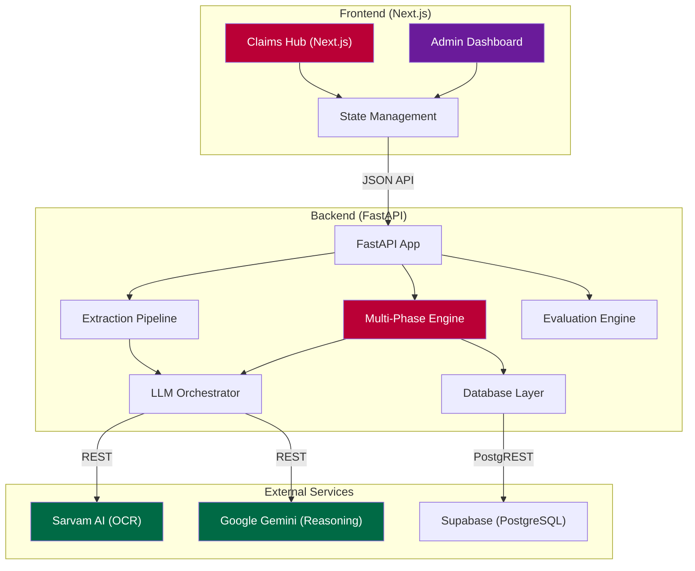

# System Architecture

The Plum Claim Engine is built with a decoupled architecture focusing on reliability, AI-powered document intelligence, and strict business rule enforcement.

## Architecture Diagram

## Component Breakdown

### 1. Adjudication Engine
- **Phase 0: Integrity Check**: Validates submission windows (30 days), duplicate claims, and suspicious frequency patterns.
- **Phase 1: Basic Eligibility**: Enforces waiting periods for specific ailments based on member join date.
- **Phase 2: Document Consistency**: Employs LLMs to cross-reference patient identity and doctor registration across all transcripts.
- **Phase 3: Coverage & Financials**: Calculates itemized deductions, applies co-pays (10%), and enforces consultation caps (₹1000).

### 2. AI Intelligence Layer (Multi-Model)
- **Sarvam AI**: Specialized for high-fidelity extraction of structured fields from medical bills and prescriptions.
- **Gemini 1.5 Flash/Pro**: Utilized for complex medical reasoning, determining necessity, and identifying excluded treatments.
- **Failover & Caching**: Implements a robust `LLMClient` with API key rotations and a local OCR cache to optimize performance and cost.

### 3. Admin & Evaluation Core
- **Admin Dashboard**: Enables policy administrators to override automated verdicts and view detailed audit logs.
- **Evaluation Engine**: A specialized suite that runs the entire codebase against a ground-truth `test_cases.json` to generate precision/recall metrics.

### 4. Data Persistence (Supabase)
- Real-time indexing of every claim and verdict.
- Storage of medical document artifacts.
- Persistent logging of AI thought processes for regulatory transparency.
