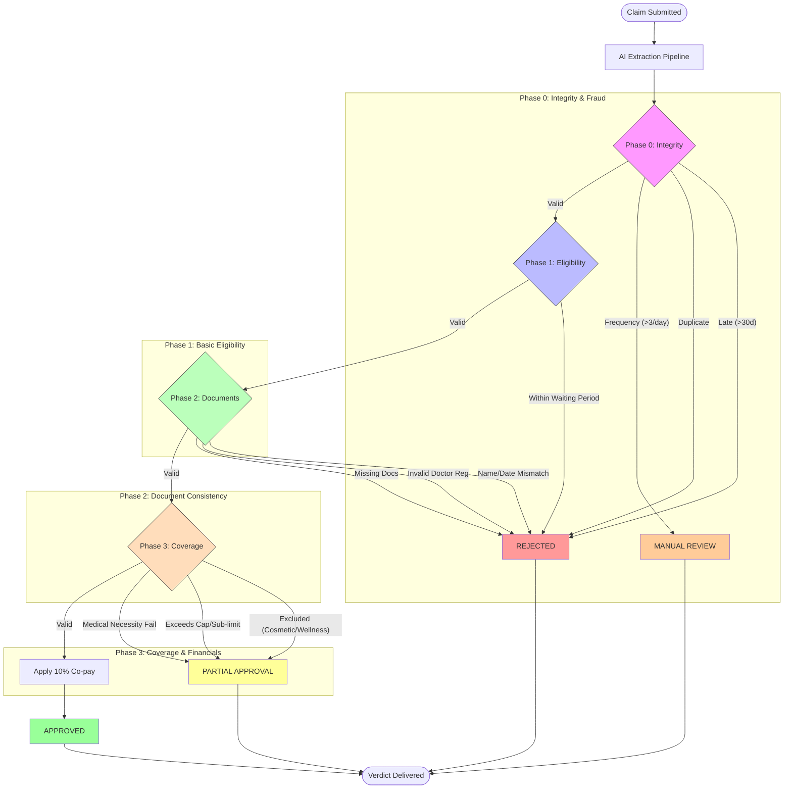

# Decision Logic Flowchart

The following flowchart illustrates the step-by-step logic used by the Adjudication Engine to transition from a claim submission to a final verdict.

## Logic Detail

### Phase 0: Integrity & Process
- **Deadline Enforcement**: Claims must be submitted within 30 days of treatment.
- **Duplicate Prevention**: Rejects claims with identical member IDs, dates, and amounts.
- **Fraud Signal**: Flagging members submitting >3 claims in a 24-hour period for human audit.

### Phase 1: Policy Eligibility
- **Waiting Periods**: Checks if the treatment date is within the specific exclusion window for chronic conditions (e.g., 90 days for Diabetes).

### Phase 2: AI Document Audit
- **Consistency Check**: LLMs verify that the patient name and treatment date are consistent across the bill and the prescription.
- **Doctor Verification**: Ensures the doctor's registration number follows the Indian medical council format.

### Phase 3: Financial Calculations
- **Exclusions**: Semantic identification of non-covered items (e.g., teeth whitening, weight loss).
- **Sub-limits**: Capping consultations at ₹1000.
- **Co-pay**: Final 10% deduction on the net approved amount.
