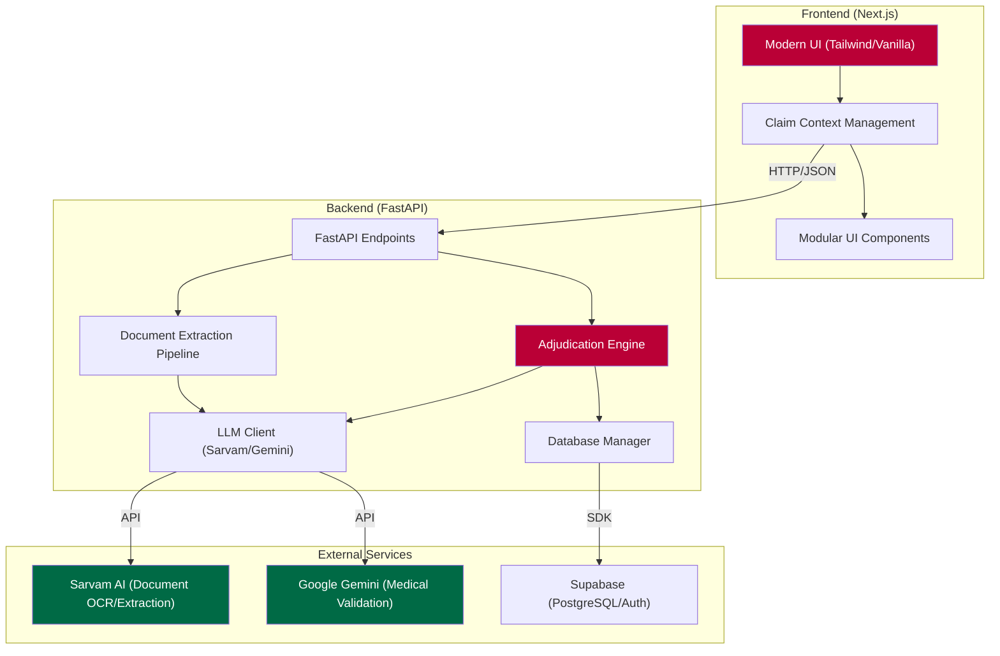

# System Architecture

The Plum Claim Engine is built with a decoupled architecture focusing on reliability, AI-powered document intelligence, and strict business rule enforcement.

## Architecture Diagram

## Component Breakdown

### 1. Backend Adjudicator
- **Phase 1: Integrity Check**: Validates submission dates, duplicate claims, and suspicious patterns.
- **Phase 2: Document Consistency**: Uses LLMs to cross-reference prescriptions against bills and patient IDs.
- **Phase 3: Coverage Verification**: Enforces policy sub-limits, waiting periods, and exclusions.
- **Phase 4: Financial Calculation**: Applies co-pays and calculates the final net payout.

### 2. AI Intelligence Layer
- **Sarvam AI**: Utilized for high-accuracy OCR and structured data extraction from clinical documents.
- **Gemini 1.5**: Acts as the "Medical Brain" for detecting excluded treatments (e.g., cosmetic procedures) and verifying medical necessity.
- **Fallback Logic**: The `LLMClient` implements automatic failover between models to ensure 99.9% uptime despite rate limits.

### 3. Data Persistence (Supabase)
- Stores audit logs for every adjudication step.
- Flags fraudulent cases for manual review.
- Persists policy terms for dynamic updates.
