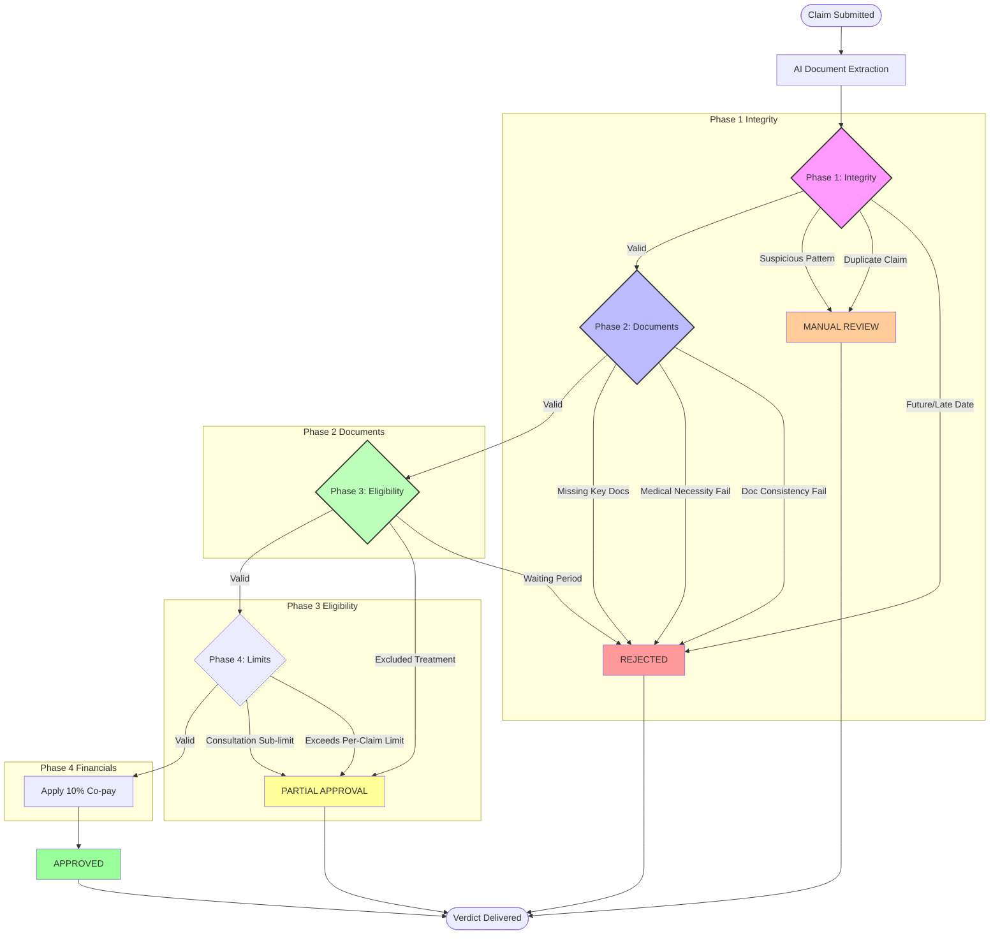

# Decision Logic Flowchart

The following flowchart illustrates the step-by-step logic used by the Adjudication Engine to transition from a claim submission to a final verdict.

## Key Logic Junctions

### Integrity Checks
The system first checks if the treatment date is within the coverage window (last 30 days) and ensures no duplicate claims are filed by the same member on the same day.

### AI Decision Points
The engine delegates "Medical Necessity" and "Document Consistency" to an LLM agent. If the bill contains items not mentioned in the prescription (e.g., cosmetic whitening in a dental claim), it is automatically flagged for partial approval or rejection.

### Financial Enforcements
- **Co-pay**: A mandatory 10% co-payment is deducted from all approved amounts.
- **Consultation Limit**: Doctor fees are capped at ₹1000 per visit.
- **Per-Claim Limit**: Maximum payout per OPD claim is ₹5000.
